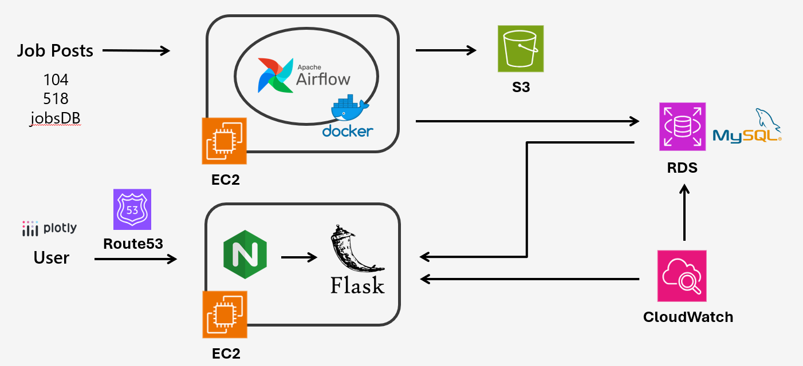
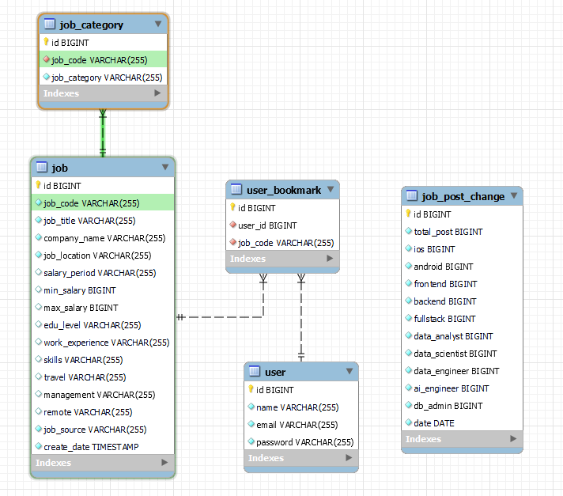

# Career Compass

A website providing software engineers to search jobs in Taiwan and Hong Kong, also getting an overview on wages and required specifications for different domains through dashboard.

Website url: https://careercompass.asia/

Account to add job postings into favorites, here is a test account:
- Email: chris@gmail.com
- Password: chrischris

## Table of Contents

- Technologies Used
- Architecture
- Data Pipeline
- Database Schema
- Feature Demo
- Contact

## Technologies Used

Programming Languages: Python, Javascript, HTML, CSS
Cloud Services: AWS EC2, RDS, S3, CloudWatch
Tools: Docker, Airflow, Nginx, Gunicorn, Plotly

## Architecture

System Architecture

- EC2 #1: Executing web crawling every daily orchestrated by Airflow on Docker
- EC2 #2: Hosting Flask web app, retrieving data from MySQL and visualize for users
- RDS (MySQL) / S3: Store daily updates and historical data.
- Cloudwatch: Monitor Flask web app and RDS condition.

## Data Pipeline

- Source: 104, 518, JobsDB
- Extract: requests + Selenium (web crawling)
- Transform: Python + Google Gemini (data cleaning and extraction)
- Load: AWS RDS + S3 (backup)

## Database Schema

## Feature Demo

### Search
- [search](readme_materials/function_search.gif)

### Bookmark
- [bookmark](readme_materials/function_bookmark.gif)

### Dashboard
- [dashboard](readme_materials/function_dashboard.gif)

## Contact

Anny Liao beringsailor@gmail.com
